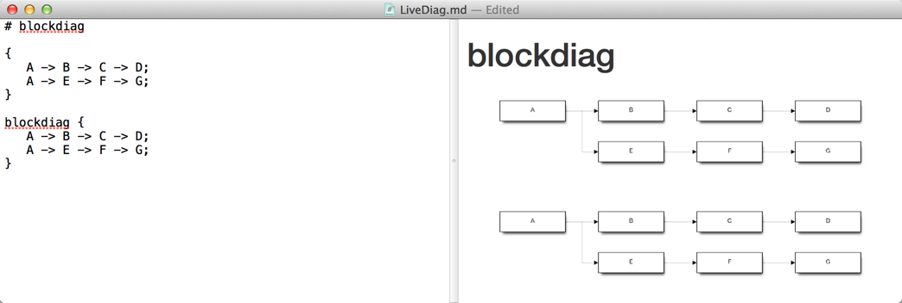
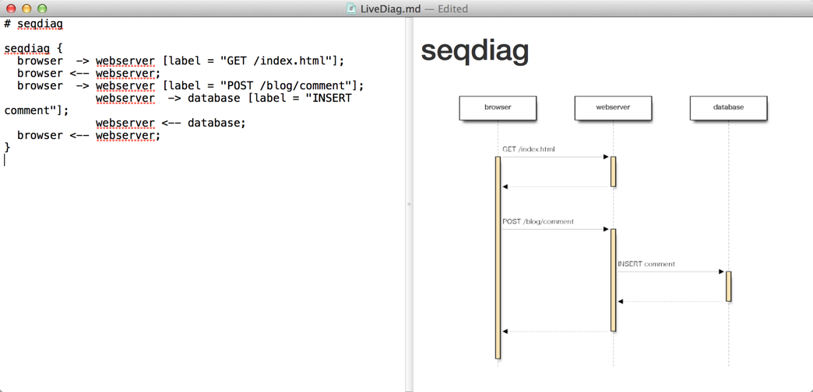
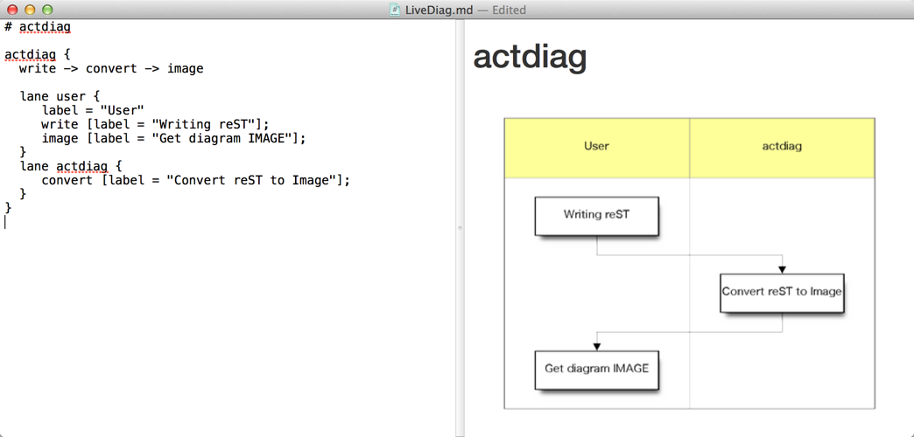
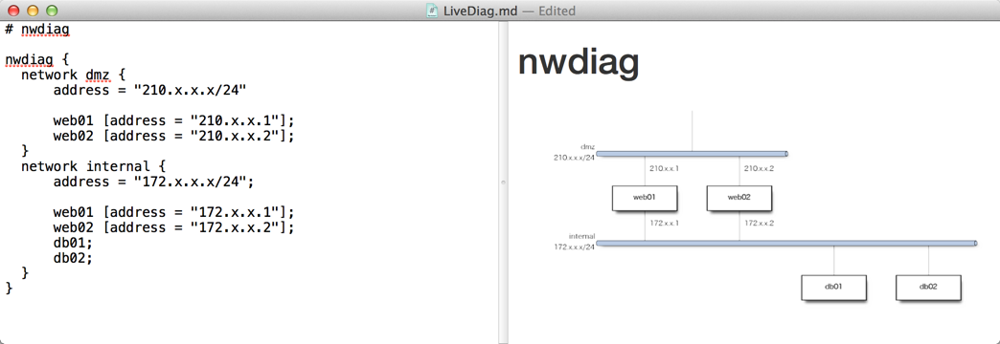
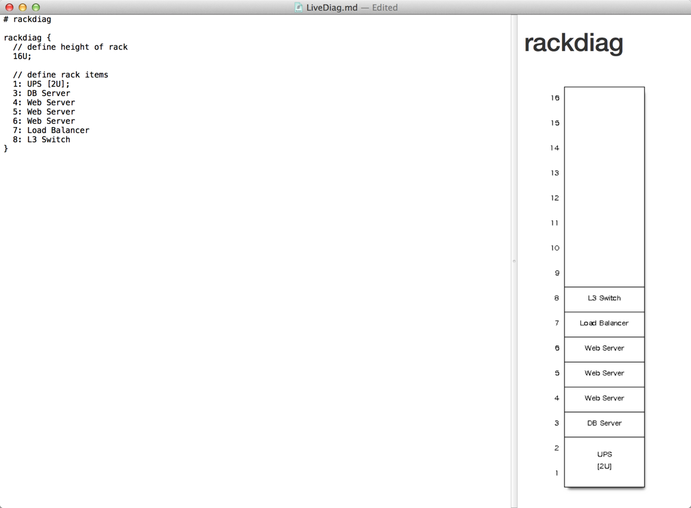

LiveDiag
========

Live Preview App for Markdown+blockdiag(+seqdiag +actdiag +nwdiag +rackdiag)

all block code from [blockdiag.com](http://blockdiag.com/). Thanks!!

## Platform

- Mac OS 10.7+

## Requirement

- [blockdiag](http://blockdiag.com/ja/blockdiag/introduction.html#id2)
- [seqdiag](http://blockdiag.com/ja/seqdiag/introduction.html#setup)
- [actdiag](http://blockdiag.com/ja/actdiag/introduction.html#setup)
- [nwdiag|rackdiag](http://blockdiag.com/ja/nwdiag/introduction.html#setup)

## Installation
1. Install [blockdiag](http://blockdiag.com/ja/blockdiag/introduction.html#macosx-macports), [seqdiag](http://blockdiag.com/ja/seqdiag/introduction.html#setup), [actdiag](http://blockdiag.com/ja/actdiag/introduction.html#setup) and [nwdiag|rackdiag](http://blockdiag.com/ja/nwdiag/introduction.html#setup)

2. Download [LiveDiag.app](https://github.com/dataich/LiveDiag/releases/download/1.2.0/LiveDiag.app.zip) and place it to /Applications

## Release

[Releases · dataich/LiveDiag](https://github.com/dataich/LiveDiag/releases)

## Feature

- live preview for following content
	- Markdown
	- blockdiag
	- seqdiag
	- actdiag
	- nwdiag
	- rackdiag
- printing

## Give me your feedback

If you have any suggestion and find bugs, please let me know.

- Contact to [@dataich](https://twitter.com/dataich)
- Post to [Github Issues](https://github.com/dataich/LiveDiag/issues)